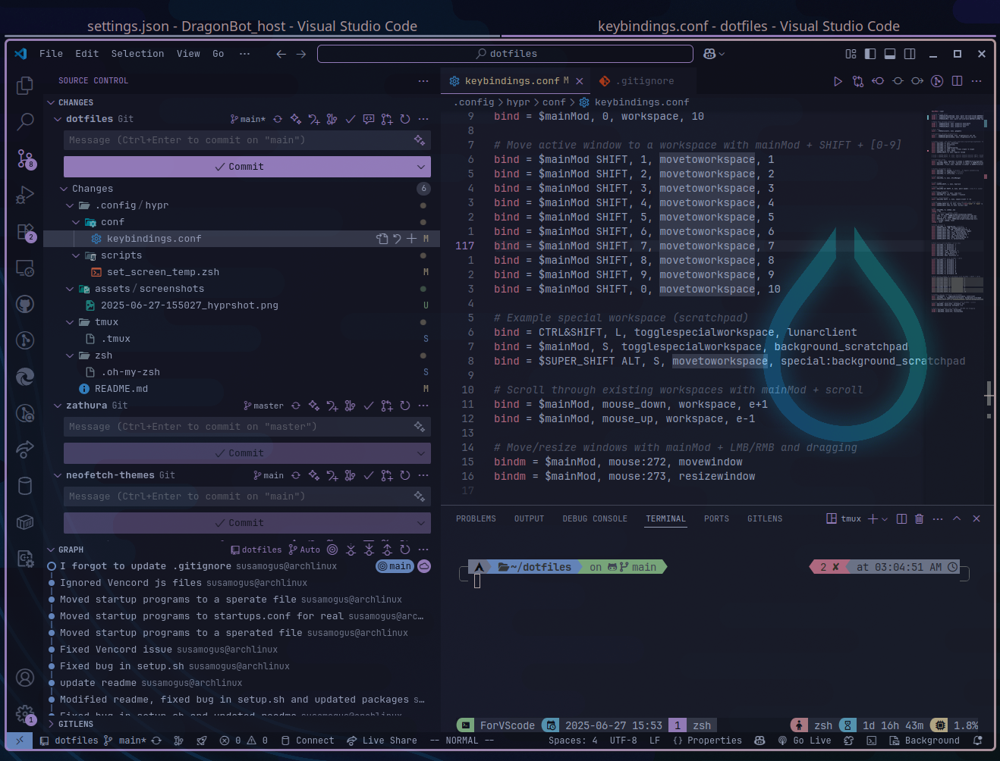

# dotfiles

Dotfiles for arch linux

## Requirements

Arch linux (minimal setup is prefered)

## Installation

```bash
 sudo pacman -S git
 git clone --recurse-submodules https://github.com/xDDoubleTea/dotfiles ~/dotfiles
 cd dotfiles/
 chmod +x ./setup.sh
 ./setup.sh
```

Take a look at the minimal_packages.txt to know what packages were installed.

You're all setup!

The install script has been tested on a fresh arch linux install, and should work without issues.
It has also been tested on wsl with arch linux, and should work without issues as well.

The install script will stow all the directories in this repo, which means it will create symlinks in your home directory to the files in the directories.
If you don't want to use the install script, you can install a program called `stow`, and then run the following commands:

```bash
stow package
```

where `package` is a directory of this repo (you can take a look at `all_stowed_files.txt`). What this does is it will create symlinks in your home directory to the files in the `package` directory. For example, if you run `stow nvim`, it will create symlinks in your home directory to the files in the `nvim` directory. Since `nvim` contains `.config/nvim`, it will create a symlink in your home directory to `~/.config/nvim`.

After creating the symlinks, you can just install and run neovim, and it will use the configuration in `~/.config/nvim`.

Before stowing, make sure to backup your existing configuration files (using `mv ~/.config/nvim ~/.config/nvim_bak` for example), as they will be overwritten by the symlinks created by stow.

All the configurations after stowing should be done through modifying the files in the `~/dotfiles` directory, as the symlinks will point to those files. For example, if you want to modify the neovim configuration, you can edit the file `~/dotfiles/nvim/init.lua`, and it will be reflected in `~/.config/nvim/init.lua`.

## Notes

The `--recurse-submodules` option in git clone is necessary, as it clones the submodules in this repo, which are dependencies for ohmyzsh, ohmytmux, neofetch theme and zathura theme to work.

The install script assumes you want the default settings of kitty and hypr to be replaced.

As a user coming from an era where hyprland (uwsm-managed) wasn't a thing, this setup might not work if you chose to start up hyprland with it.

I use Zen-browser as my main browser, it is a fork of firefox with some privacy features and performance improvements.

## Screenshots

## Workspaces and Windows rules

You can switch between workspaces using `super+{number}`, the first `6` workspaces are named, with their name being:  
`Zen-browser, Coding, Discord, Media, Games, VScode`.  
Discord will be automatically opened once you switched to the workspace `Discord`, and VScode will also be opened once you switched to the workspace `VScode`.  

> I use VScode mainly for git stuff (mainly using AI to generate commit messages) and viewing sql databases. I code on neovim. This is why the Coding workspace and the VScode workspace are seperated.

These are done through the workspace rules, you can check `~/dotfiles/hypr/.config/hypr/conf/workspacerules.conf` and [Workspace Rules – Hyprland Wiki](https://wiki.hypr.land/Configuring/Workspace-Rules/).

## Todos

- [ ] Add dock
- [ ] Add some widgets using eww
- [ ] Support for changing light/dark modes.

## Assets

## Tips

You can group some windows together by creating a group using `super+t`
It will look something like this


Notice that there is a group tab above the window, you can use `super+shift+tab` to cycle forward, and `super+shift+alt+tab` to cycle backward (`super+tab` will not work for some reason)
There are more keyboard shortcuts for group, check it out in the group action section in keybindings settings.

## Credits

- hyprland and waybar configurations were built on top of that of this repo: [typecraft-dev/dotfiles](https://github.com/typecraft-dev/dotfiles)

- Neovim configurations  
  - For the main config I use lazyvim:  
    [🚀 Getting Started | LazyVim](https://www.lazyvim.org/)  
  - [NvChad](https://nvchad.com/)

- Hyprland  
[hyprland.org/](https://hypr.land/)
