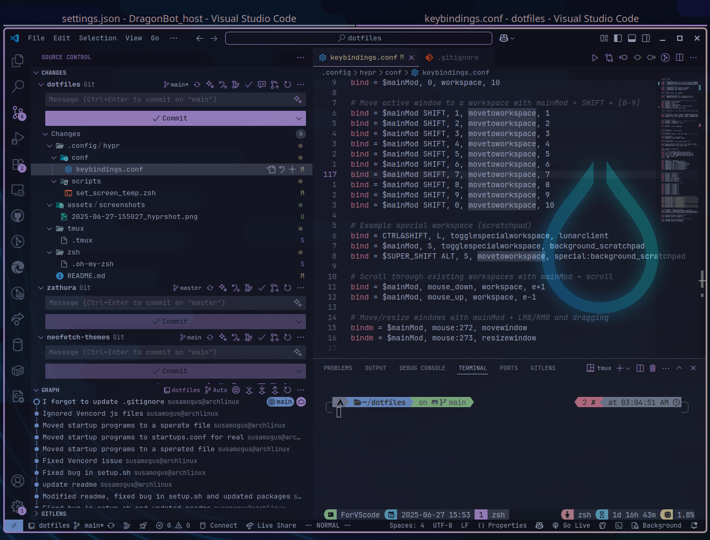

# dotfiles


Dotfiles for Arch Linux with a Hyprland desktop, and for the CLI subset on
FreeBSD, Ubuntu/Debian, Fedora, Gentoo and macOS.

## Requirements

- **Arch Linux** for the full Hyprland desktop. A minimal install with a non-root
  user that has sudo is preferred.
- **Everything else** gets the *core* CLI tools. This covers the headless VMs:
  FreeBSD, Ubuntu 24.04 server, Debian, Fedora, Gentoo and macOS.

`git`, `stow` and a POSIX `/bin/sh` are the only hard requirements. The bootstrap
installs Python 3 if it is missing.

## Installation

```bash
git clone --recurse-submodules https://github.com/xDDoubleTea/dotfiles ~/dotfiles
cd ~/dotfiles
./setup.sh              # core CLI tools, all platforms
./setup.sh --desktop    # core + the Hyprland desktop (Arch only)
```

`--recurse-submodules` is required — oh-my-zsh, ohmytmux, powerlevel10k and
zsh-vi-mode are submodules, and the shell needs all four. Repair a clone made
without it:

```bash
git submodule update --init --recursive
```

### What setup.sh does

`setup.sh` is a POSIX `sh` script that detects the OS, ensures Python 3 is
installed, and hands over to `tools/install.py`. That script validates package
names, installs them, initialises submodules, stows the packages, installs
vim-plug, and sets the login shell to zsh.

| Flag | Effect |
| --- | --- |
| `--desktop` | also install the Hyprland desktop group (Arch only) |
| `--dry-run` | print every command, change nothing |
| `--skip-packages` | stow only |
| `--skip-stow` | install packages, create no symlinks |
| `--only PKG...` | stow just these packages |
| `--manager KEY` | use the named package manager, skipping detection |
| `--dump-list [KEY]` | print the resolved package names for a manager |

`./setup.sh --dry-run` prints the exact package list and stow operations without
touching the system. Run it first on a new machine.

### Package manager per OS

Packages are declared in `packages/manifest.json` and mapped to per-OS names from
there. `minimal_packages.txt` is a generated Arch view of the same data.

| OS | Manager | Groups |
| --- | --- | --- |
| Arch | `yay`, falling back to `pacman` when no AUR package is in scope | core + desktop |
| FreeBSD | `pkg` | core |
| macOS | `brew` | core |
| Debian | `apt-get` | core |
| Ubuntu | `apt-get` | core |
| Fedora | `dnf` | core |
| Gentoo | `emerge` | core |

Package names differ between managers: `fd` is `fd-find` on FreeBSD, Debian and
Fedora; Arch's `github-cli` is `gh` elsewhere; FreeBSD calls Node `node` and
packages `npm` separately.

Ubuntu and Debian have separate columns. Both use apt, and `install.py` tells
them apart by the `ID` field in `/etc/os-release`; an apt distro matching neither
falls back to the Debian column. Their package sets differ — Ubuntu 24.04
predates the Debian uploads of `lazygit` and `atuin`, so both are skipped there.

The Arch, FreeBSD, Debian, Ubuntu and macOS columns are verified against a live
package manager. Fedora and Gentoo entries carry an `unverified` marker. `install.py`
checks every name against the local package manager before installing anything
and reports all failures at once. Clear the marker for a manager once a real
machine confirms the name.

Packages absent from a manager are declared `null` there and skipped with a
message — Homebrew has no `zathura`, apt has no `yazi`.

Name validation cannot detect conflicts between two packages that both exist. On
Ubuntu and Debian, `npm` is skipped because NodeSource's `nodejs` bundles npm and
declares `Conflicts: npm`. A Debian system without the NodeSource repository gets
node without npm.

## Installing without setup.sh

Stowing by hand is fully supported, and is the usual path on a CLI-only VM:

```bash
cd ~/dotfiles
stow nvim        # symlinks ~/.config/nvim -> ~/dotfiles/nvim/.config/nvim
stow zsh         # symlinks ~/.zshrc, ~/.zprofile, ~/.zsh_custom, ...
```

Each top-level directory is a stow package whose contents mirror the path
relative to `$HOME`, so `nvim/.config/nvim` lands at `~/.config/nvim`.
`all_stowed_files.txt` lists the packages `setup.sh` installs by default; other
directories in the repo are stowed manually.

Back up an existing config first (`mv ~/.config/nvim ~/.config/nvim_bak`), or let
`setup.sh` handle it — it renames conflicting files to `<name>.bak` before
stowing. `stow -D <package>` removes a package's symlinks, and `stow -R <package>`
restows after adding or deleting files inside one.

Edit the files in `~/dotfiles`. The paths under `~/.config` are symlinks back
into the repo.

## Shell setup

Everything zsh needs is tracked in the repo.

```
zsh/.zshrc                              sets ZSH_CUSTOM="$HOME/.zsh_custom"
zsh/.zsh_custom/alias.zsh               aliases
zsh/.zsh_custom/themes/powerlevel10k/   submodule
zsh/.zsh_custom/plugins/zsh-vi-mode/    submodule
zsh/.p10k.zsh                           powerlevel10k config
```

Customisations live in `~/.zsh_custom`, outside `~/.oh-my-zsh/custom`. oh-my-zsh
ignores `custom/` in its own `.gitignore`, so files kept there are invisible to
both the submodule and this repo and disappear on a fresh clone. Setting
`ZSH_CUSTOM` to a stowed directory keeps them tracked.

Two hooks are guarded by a command check, because neither tool is packaged on
every target: `navi` (absent from Ubuntu and Debian) and `atuin`.

On Ubuntu and Debian, bat's binary is named `batcat`. `alias.zsh` detects this
and aliases `bat` to it, and points fzf's `--preview` at the same binary.

## SSH agent

`zsh/.zprofile` handles this per-OS and needs no configuration:

- **Linux** — uses the systemd user socket, `SSH_AUTH_SOCK=$XDG_RUNTIME_DIR/ssh-agent.socket`.
  Enable it once with `systemctl --user enable --now ssh-agent.socket`.
- **FreeBSD / macOS** — falls back to `keychain --eval id_ed25519`, which reuses
  one agent across logins. `keychain` is in the core package group.

## Editors

Neovim is the main editor (`nvim/`), with NvChad and LazyVim variants in
`nvim_nvchad/` and `nvim_lazy/`.

### First run on a new machine

nvim-treesitter compiles parsers on demand, and lazy.nvim needs the `vimdoc`
parser to generate helptags — so the first sync has to install that parser
partway through:

```bash
nvim --headless -c 'Lazy! restore' -c qa
nvim --headless -c 'TSInstall vimdoc' -c qa
nvim --headless -c 'Lazy! restore' -c qa
```

Once per machine. Afterwards `Lazy restore` alone is enough.

`Lazy restore` pins every plugin to `lazy-lock.json`. `Lazy update` and
`Lazy sync` rewrite that file to the latest upstream commits — run those on one
machine, commit the lockfile, and `Lazy restore` on the others.

### Input method

`im-select.nvim` switches the system input method on mode changes, and picks its
backend from the OS: `macism` with `com.apple.keylayout.ABC` on macOS,
`fcitx5-remote` with `keyboard-us` elsewhere. It loads only when that backend is
on `PATH`, so it stays out of the way on headless boxes reached over SSH.

`macism` lives in a tap rather than homebrew-core, so install it separately:

```bash
brew tap laishulu/homebrew
brew install macism
```

On Arch, `fcitx5-remote` comes with the `fcitx5` package in the desktop group.

**FreeBSD** base ships neither vim nor nvim, so the `vim` package installs one.
The working config there is `vim/.vimrc`; nvim is installed but not configured,
so use `vim` or stow `nvim` yourself.

`vim/.vimrc` calls `plug#begin()` on its first line and needs vim-plug. `setup.sh`
downloads it to `~/.vim/autoload/plug.vim` after stowing, then runs
`:PlugInstall`. Both steps are skipped when plug.vim is present. Neither is
fatal — run `:PlugInstall` inside vim if the download fails.

## Yazi plugins

Plugins under `yazi/.config/yazi/plugins/` are tracked as plain files, so a clone
gets them. `yazi/.config/yazi/package.toml` pins each one by revision and hash.
`setup.sh` runs `ya pkg install` at the end to sync them; run it again at any
time.

## Notes

The four submodules are oh-my-zsh, ohmytmux, powerlevel10k and zsh-vi-mode. The neofetch and zathura themes are tracked as plain files and need nothing extra.

The install script assumes you want the default settings of kitty and hypr to be replaced.

As a user coming from an era where hyprland (uwsm-managed) wasn't a thing, this setup might not work if you chose to start up hyprland with it.

I use Zen-browser as my main browser, it is a fork of firefox with some privacy features and performance improvements.

## Screenshots

## Workspaces and Windows rules

You can switch between workspaces using `super+{number}`, the first `6` workspaces are named, with their name being:
`Zen-browser, Coding, Discord, Media, Games, VScode`.
Discord will be automatically opened once you switched to the workspace `Discord`, and VScode will also be opened once you switched to the workspace `VScode`.

> I use VScode mainly for git stuff (mainly using AI to generate commit messages) and viewing sql databases. I code on neovim. This is why the Coding workspace and the VScode workspace are seperated.

These are done through the workspace rules, you can check `~/dotfiles/hypr/.config/hypr/conf/workspacerules.conf` and [Workspace Rules – Hyprland Wiki](https://wiki.hypr.land/Configuring/Workspace-Rules/).

## Todos

- [ ] Add dock
- [ ] Add some widgets using eww
- [ ] Support for changing light/dark modes.

## Assets

## Tips

You can group some windows together by creating a group using `super+t`
It will look something like this


Notice that there is a group tab above the window, you can use `super+shift+tab` to cycle forward, and `super+shift+alt+tab` to cycle backward (`super+tab` will not work for some reason)
There are more keyboard shortcuts for group, check it out in the group action section in keybindings settings.

## Credits

- hyprland and waybar configurations were built on top of that of this repo: [typecraft-dev/dotfiles](https://github.com/typecraft-dev/dotfiles)

- Neovim configurations
  - For the main config I use the following:
    [ntk148v/neovim-config: A minimal neovim configuration written in Lua](https://github.com/ntk148v/neovim-config/tree/master?tab=readme-ov-file)
  - [NvChad](https://nvchad.com/)
  - [🚀 Getting Started | LazyVim](https://www.lazyvim.org/)
  - [LunarVim/Launch.nvim: 🚀 Launch.nvim is modular starter for Neovim.](https://github.com/LunarVim/Launch.nvim)

- Hyprland
  [hyprland.org/](https://hypr.land/)
